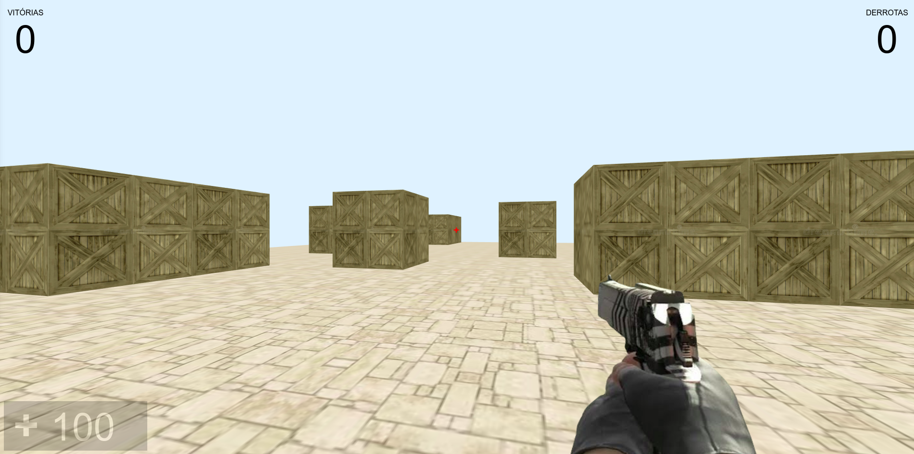

# JS:GO - Jogo em primeira pessoa utilizando three.js
Baseado no jodo de computador Couter Strike (CS:GO)

Esse repositório foi criado com o objetivo de apresentar as possibilidades da bilbioteca three.js, onde montei um vídeo no youtube (conforme lilnk abaixo) com uma rápida explicação, apesar de não estar muito organizado estou disponibilizando o codigo para quem quiser evoluir ainda mais!

http://youtube.com.br/rodrigoKulb

# DEMO
Player 1
http://rodrigo-kulb.com.br/threejs/game/index.php?p=1

Player 2
http://rodrigo-kulb.com.br/threejs/game/index.php?p=2
